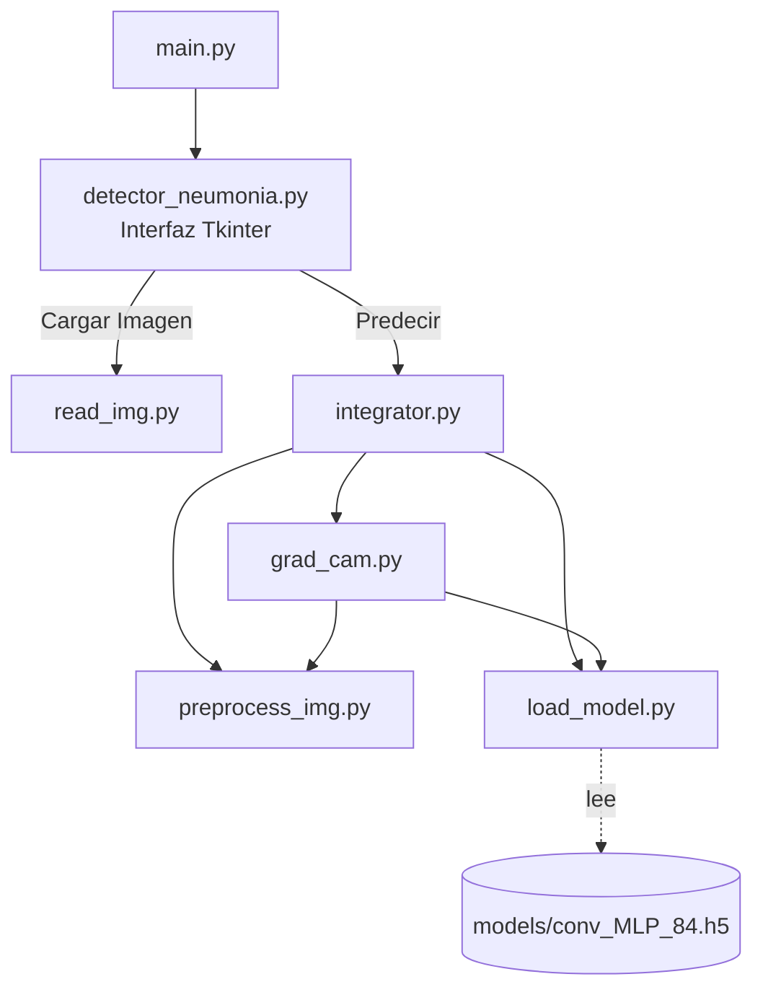

# UAO-Neumonía

Herramienta de escritorio para el apoyo al diagnóstico rápido de neumonía a partir de radiografías de tórax, usando Deep Learning y Grad-CAM para explicar visualmente cada predicción.


> **Nota:** este es un proyecto académico (Especialización en Inteligencia Artificial, UAO). Es una herramienta de **apoyo**, no un dispositivo médico validado clínicamente; ninguna predicción generada aquí debe usarse como diagnóstico definitivo sin la revisión de un profesional de la salud.

---

## Tabla de contenido

- [¿Qué hace?](#qué-hace)
- [Arquitectura](#arquitectura)
- [Acerca del modelo](#acerca-del-modelo)
- [Acerca de Grad-CAM](#acerca-de-grad-cam)
- [Instalación](#instalación)
- [Ejecución](#ejecución)
- [Uso de la interfaz gráfica](#uso-de-la-interfaz-gráfica)
- [Pruebas unitarias](#pruebas-unitarias)
- [Makefile](#makefile)
- [Docker](#docker)
- [Licencia](#licencia)
- [Autores](#autores)

---

## ¿Qué hace?

Clasifica una radiografía de tórax (DICOM, JPG o PNG) en una de tres categorías:

1. Neumonía Bacteriana
2. Neumonía Viral
3. Sin Neumonía

Además de la clase y su probabilidad, genera un **mapa de calor Grad-CAM** superpuesto sobre la imagen original, resaltando las regiones que más influyeron en la predicción del modelo. Desde la interfaz se puede guardar el resultado en un historial CSV y exportar un reporte en PDF.

## Arquitectura

El proyecto es modular: la interfaz gráfica no contiene lógica de inferencia, solo orquesta llamadas a módulos independientes y con responsabilidad única.



| Módulo | Responsabilidad |
|---|---|
| `main.py` | Punto de entrada de la aplicación. |
| `detector_neumonia.py` | Interfaz gráfica (Tkinter): carga de imágenes, botones, historial y exportación a PDF. No contiene lógica de inferencia. |
| `read_img.py` | Lee un archivo DICOM o JPG/PNG y lo convierte a un array numpy listo para preprocesar. |
| `preprocess_img.py` | Preprocesa el array: resize a 512×512, escala de grises, ecualización CLAHE, normalización 0–1, formato de batch. |
| `load_model.py` | Carga (una sola vez, con caché) el modelo entrenado desde `models/conv_MLP_84.h5`. |
| `grad_cam.py` | Genera el mapa de calor Grad-CAM sobre la imagen, usando `tf.GradientTape`. |
| `integrator.py` | Orquesta preprocesamiento → predicción → Grad-CAM y devuelve `(label, proba, heatmap)` a la interfaz. |

### Árbol de archivos

```
UAO-Neumonia/
├── .github/
│   └── pull_request_template.md
├── models/
│   └── conv_MLP_84.h5        # no versionado en git (~117MB), ver Instalación
├── tests/
│   ├── conftest.py
│   ├── test_grad_cam.py
│   ├── test_integrator.py
│   ├── test_load_model.py
│   ├── test_preprocess_img.py
│   └── test_read_img.py
├── detector_neumonia.py      # interfaz gráfica (Tkinter)
├── integrator.py             # orquesta el flujo de predicción
├── read_img.py               # lectura de DICOM / JPG / PNG
├── preprocess_img.py         # preprocesamiento de la imagen
├── load_model.py             # carga del modelo entrenado
├── grad_cam.py                # generación del heatmap Grad-CAM
├── main.py                   # punto de entrada
├── Dockerfile
├── .dockerignore
├── Makefile
├── pyproject.toml
├── uv.lock
├── .python-version
├── .gitignore
├── LICENSE
└── README.md
```

## Acerca del modelo

La red neuronal convolucional (CNN) está basada en el modelo propuesto por F. Pasa, V. Golkov, F. Pfeifer, D. Cremers & D. Pfeifer en su artículo *Efficient Deep Network Architectures for Fast Chest X-Ray Tuberculosis Screening and Visualization*.

Está compuesta por 5 bloques convolucionales, cada uno con 3 convoluciones (dos secuenciales y una conexión *skip* que evita el desvanecimiento del gradiente en profundidad), con 16, 32, 48, 64 y 80 filtros de 3×3 respectivamente.

Después de cada bloque hay una capa de max pooling, y tras el último bloque, una capa de Average Pooling seguida de tres capas fully-connected (1024, 1024 y 3 neuronas). Para regularizar se usan 3 capas de Dropout al 20%: dos en los bloques 4 y 5, y otra después de la primera capa densa.

## Acerca de Grad-CAM

Grad-CAM (*Gradient-weighted Class Activation Mapping*) resalta las regiones de una imagen más relevantes para la clasificación. Calcula el gradiente de la salida correspondiente a la clase predicha respecto a las neuronas de la última capa convolucional, obteniendo así la importancia de cada neurona en la decisión. Con esos pesos se hace una combinación lineal con el mapa de activaciones de esa capa, produciendo un heatmap que se superpone sobre la radiografía original: las zonas más "calientes" son las que más influyeron en la predicción.

## Instalación

Requisitos: **Python 3.12+** y [**uv**](https://docs.astral.sh/uv/getting-started/installation/) como gestor de paquetes y entornos.

```bash
git clone https://github.com/milton329/UAO-Neumonia.git
cd UAO-Neumonia

# Instala/sincroniza todas las dependencias (equivalente: make install)
uv sync
```

`uv sync` crea el entorno virtual (`.venv/`) y resuelve las dependencias exactas del `uv.lock`, sin necesidad de `pip install -r requirements.txt` ni de activar el entorno manualmente.

**El modelo entrenado no viaja en git** (pesa ~117MB). Copia `conv_MLP_84.h5` dentro de `models/` antes de ejecutar la app:

```
UAO-Neumonia/
└── models/
    └── conv_MLP_84.h5
```

Imágenes de radiografía de prueba (DICOM) disponibles en [este Drive](https://drive.google.com/drive/folders/1WOuL0wdVC6aojy8IfssHcqZ4Up14dy0g?usp=drive_link).

## Ejecución

```bash
make detector
# equivalente a: uv run python main.py
```

Ver [Makefile](#makefile) para el resto de comandos disponibles, o [Docker](#docker) para correrlo en contenedor.

## Uso de la interfaz gráfica

1. Ingresa la cédula del paciente en la caja de texto.
2. Presiona **Cargar Imagen** y selecciona un archivo DICOM, JPG o PNG.
3. Presiona **Predecir** y espera unos segundos hasta ver el resultado y el heatmap.
4. Presiona **Guardar** para agregar el resultado al historial (`historial.csv`).
5. Presiona **PDF** para exportar un reporte (`Reporte_<cédula>.pdf`).
6. Presiona **Borrar** para limpiar la interfaz y cargar una nueva imagen.

## Pruebas unitarias

```bash
make test
# equivalente a: uv run pytest
```

La suite (42 pruebas) cubre `read_img`, `preprocess_img`, `load_model`, `grad_cam` e `integrator`. La mayoría usa mocks o un modelo Keras diminuto (fixture `tiny_cnn_model`), por lo que corren en segundos y **no dependen de tener el modelo real de 117MB descargado**. Para medir cobertura:

```bash
uv run pytest --cov
```

## Makefile

Todos los comandos corren dentro del entorno de `uv`, sin necesidad de activarlo manualmente:

| Comando | Qué hace |
|---|---|
| `make help` | Lista todos los targets disponibles (target por defecto). |
| `make install` | Instala/sincroniza las dependencias del proyecto (`uv sync`). |
| `make detector` | Lanza la interfaz gráfica de la aplicación. |
| `make test` | Corre la suite de pruebas unitarias (`pytest`). |
| `make lint` | Revisa el estilo del código con `ruff`, sin modificar archivos. |
| `make format` | Formatea el código automáticamente con `ruff`. |
| `make clean` | Elimina cachés y artefactos generados localmente (`__pycache__`, `.pytest_cache`, `.ruff_cache`). |
| `make docker-build` | Construye la imagen Docker de la aplicación. |
| `make docker-run` | Corre el contenedor, montando `models/` como volumen. |

## Docker

La imagen se construye en dos etapas (build con `uv`, runtime liviano) y **no incluye el modelo** — se monta como volumen en tiempo de ejecución:

```bash
make docker-build
make docker-run
# equivalente a:
docker build -t uao-neumonia .
docker run --rm -v "$(pwd)/models:/app/models" uao-neumonia
```

## Licencia

Este proyecto se distribuye bajo la licencia [MIT](LICENSE).

## Autores

Proyecto desarrollado como parte de la Especialización en Inteligencia Artificial de la Universidad Autónoma de Occidente (UAO).

- Jhanluy Bolívar
- Milton Jaramillo
- David Antonio Paredes Bravo
- Juan Diego Estupiñán

**Docente:** Jan Polanco Velasco

---

Basado en el proyecto original de Isabella Torres Revelo ([@isa-tr](https://github.com/isa-tr)) y Nicolas Diaz Salazar ([@nicolasdiazsalazar](https://github.com/nicolasdiazsalazar)).
